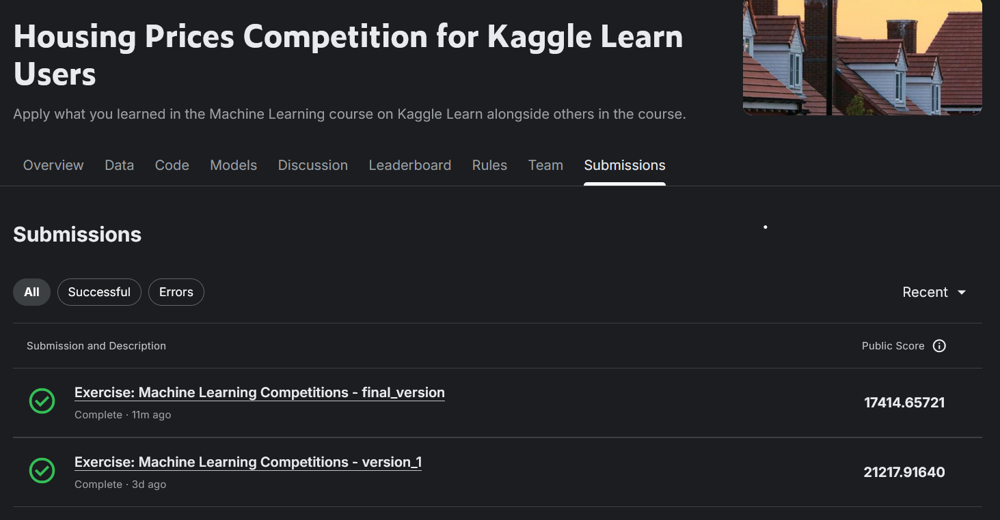

# ML Tasks Submission

This repository contains my completed tasks for the ML vertical.

---

# Completed Courses

## 1. Intro to Machine Learning
- Course Certificate: https://www.kaggle.com/learn/certification/vedantjadhav29/intro-to-machine-learning

## 2. Intro to Deep Learning
- Course Certificate: https://www.kaggle.com/learn/certification/vedantjadhav29/intro-to-deep-learning

---

# Kaggle Competition Submission

## Housing Prices Competition
- Competition Link: https://www.kaggle.com/competitions/home-data-for-ml-course
- Submission Screenshot:



---

# Repository Structure

```bash
├── README.md
├── final_submission_housing_prices.ipynb
└── submission.png
```

# Author
Vedant Jadhav
- GitHub : https://github.com/vedant-jadhav-23
- Kaggle : https://www.kaggle.com/vedantjadhav29
